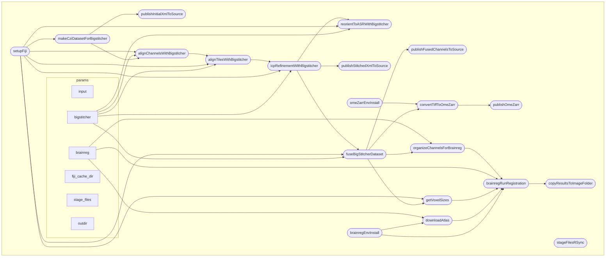

# Nextflow processing pipeline for mouse brain CZI files

This pipeline is taking one or several big Zeiss CZI image files of mouse brains, stitch them, fuse them, then register them using BrainGlobe atlases and registration tools.

It can work on a cluster / typically the SCITAS cluster @ EPFL, or locally with the local configuration.

The configurations for runnning the pipeline and for all of the processing parameters are located in `nextflow.config`



## Running the Pipeline

### Recommended Usage (with `--brain_id`)

The simplest way to run the pipeline uses `--brain_id` and `--user_name`:

```bash
# Single brain
nextflow run main.nf -resume -profile slurm --brain_id MS181 --user_name Lana_Smith -with-trace

# Multiple brains
nextflow run main.nf -resume -profile slurm --brain_id MS181,LS010 --user_name Lana_Smith -with-trace
```

This automatically constructs paths based on the data layout:
- **Input**: `<ssh_host>:<input_base_path>/<brain_id>/Anatomy/<brain_id>.czi`
- **Output**: `<ssh_host>:<output_base_path>/<user_name>/<brain_id>/`

The `ssh_host`, `input_base_path`, and `output_base_path` are configured in `nextflow.config` and rarely need overriding.

### OME-Zarr Export (optional)

To additionally convert the fused ch1 channel to a multi-resolution OME-Zarr pyramid, add the `--export_ome_zarr` flag:

```bash
nextflow run main.nf -resume -profile slurm --brain_id MS181 --user_name Lana_Smith --export_ome_zarr -with-trace
```

This writes the OME-Zarr to the local cluster storage at `/work/lsens/<user_name>/<brain_id>/ch1.ome.zarr`. The export is disabled by default.

### Dry Run (preview paths without processing)

```bash
nextflow run main.nf --brain_id MS181,LS010 --user_name Lana_Smith --dry_run
```

This prints all resolved input/output paths and exits immediately without running any processes.

### Local Execution

```bash
nextflow run main.nf -resume -profile local --input /path/to/file.czi -with-trace
```

### Multiple Files (explicit paths)

```bash
nextflow run main.nf -resume -profile local --input /path/to/file1.czi,/path/to/file2.czi -with-trace
```

### SLURM Cluster Execution

```bash
# Start a screen session (required for long-running transfers)
screen -S register_brains_0

# Load Java module
module load openjdk/21.0.0_35-h27dssk

# Run pipeline on SLURM (recommended: use --brain_id)
nextflow run main.nf -resume -profile slurm --brain_id MS181 --user_name Lana_Smith -with-trace

# Or with explicit SSH path (--user_name still needed for output publishing)
nextflow run main.nf -resume -profile slurm \
  --input user@host:/remote/path/file.czi --user_name Lana_Smith -with-trace
```

### Screen Session Management

```bash
screen -S session_name    # Start new session
screen -ls                # List sessions
screen -r session_name    # Reattach to session
# Ctrl+a d                # Detach from session
```

## How to set up this workflow on a SLURM cluster

Make sure nextflow is installed. The installation instructions are provided [here](https://www.nextflow.io/docs/latest/install.html#self-install).

You will need to have a Java module installed, for instance on EPFL's scitas cluster, this is done with `module load openjdk/21.0.0_35-h27dssk`.

Then clone the repository `git clone https://github.com/NicoKiaru/mouse_czi_processing` (current URL).

You should now be able to run the workflow in command line

## Development

To work on this project, you can:
* install vscode and its nextflow extension
* install nextflow (on wsl if you are on windows)
* install apptainer
* download a sample dataset (https://zenodo.org/records/8305531/files/Demo%20LISH%204x8%2015pct%20647.czi?download=1)
* run a test example command line


## History

This pipeline is the third iteration of a similar pipeline. The idea is to combine the functionalities of https://github.com/BIOP/lightsheet-brain-workflows with the cluster capabilities of  https://github.com/LanaSmith1313/cluster_analysis 

```
nextflow run main.nf -resume -profile slurm --brain_id BIOP_TEST --user_name Biop_User --dry_run
```