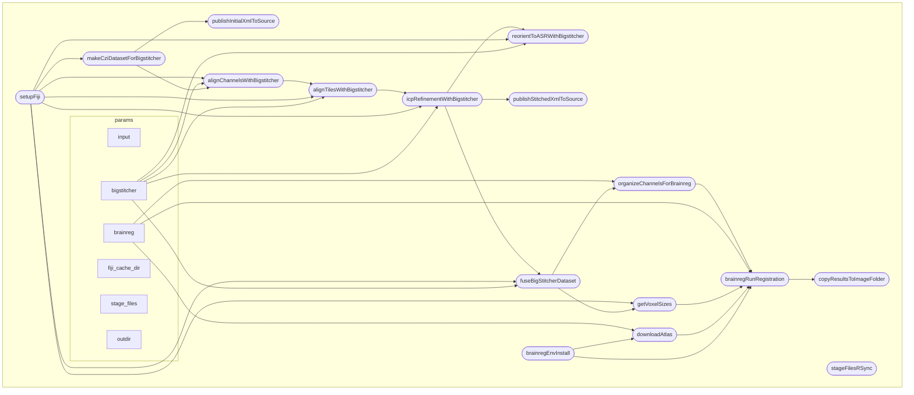

# Nextflow processing pipeline for mouse brain CZI files

This pipeline is taking one or several big Zeiss CZI image files of mouse brains, stitch them, fuse them, then register them using BrainGlobe atlases and registration tools.

It can work on a cluster / typically the SCITAS cluster @ EPFL, or locally with the local configuration.

The configurations for runnning the pipeline and for all of the processing parameters are located in `nextflow.config`



## Using this pipeline on EPFL SCITAS cluster

If not already installed, you will need to [install nextflow](https://www.nextflow.io/docs/latest/install.html#self-install).

You can then clone this repository or update / pull it.

Then nextflow will need to be ran within a [screen session](https://scitas-doc.epfl.ch/advanced-guide/screen/). Indeed the file transfer can take a long time, and you need not to be kicked out form the session.

To list all screen session in case you have some already running:

```bash
screen -ls
```

To start a screen session with the name `register_brains_0`:

```bash
screen -S register_brains_0
```

To retrieve a screen session with the name `register_brains_0`:

```bash
screen -r register_brains_0
```

Other commands for screen are:

* screen -S session_name (start a new session)
* Ctrl+a d (detach from session)
* screen -ls (list sessions)
* screen -r session_name (reattach to session)

Once within a screen session, you will need to [mount your NAS drive](https://scitas-doc.epfl.ch/user-guide/data-management/mount-nas/) - typically where your data is located.

The command will look like:

```bash
SVNAS_SHARE="smb://intranet;chiarutt@sv-nas1.rcp.epfl.ch/ptbiop-raw"
gio mount $SVNAS_SHARE
```

The shared drive will be mounted in `/home/chiarutt/server` (with the chiarutt login)

In this screen session, you will need to module the Java module:

```bash
module load openjdk/21.0.0_35-h27dssk 
module --show-hidden av 
```

You can then run the workflow.

### Recommended usage (with `--brain_id`)

The simplest way to run the pipeline uses `--brain_id` and `--user_name`. The SSH paths are constructed automatically from the data layout:

```bash
# Single brain
nextflow run main.nf -resume -profile slurm --brain_id MS181 --user_name Lana_Smith -with-trace

# Multiple brains
nextflow run main.nf -resume -profile slurm --brain_id MS181,LS010 --user_name Lana_Smith -with-trace
```

### Dry run (preview paths without processing)

To check which input/output paths will be used without actually running any processing:

```bash
nextflow run main.nf --brain_id MS181,LS010 --user_name Lana_Smith --dry_run
```

### Other examples

Local execution with explicit path:

```bash
nextflow run main.nf -resume -profile local --input test_data/ExampleMultiChannel.czi -with-trace
```

Multiple files with explicit paths:

```bash
nextflow run main.nf -resume -profile local --input /path/to/Small.czi,/path/to/Small3.czi
```

SLURM with explicit SSH path (`--user_name` still needed for output publishing):

```bash
nextflow run main.nf -resume -profile slurm --input lmsmith@haas056.rcp.epfl.ch:/mnt/lsens-data/BIOP_TEST/Test.czi --user_name Lana_Smith -with-trace
```

## How to set up this workflow on a SLURM cluster

Make sure nextflow is installed. The installation instructions are provided [here](https://www.nextflow.io/docs/latest/install.html#self-install).

You will need to have a Java module installed, for instance on EPFL's scitas cluster, this is done with `module load openjdk/21.0.0_35-h27dssk`.

Then clone the repository `git clone https://github.com/NicoKiaru/mouse_czi_processing` (current URL).

You should now be able to run the workflow in command line

## Development

To work on this project, you can:
* install vscode and its nextflow extension
* install nextflow (on wsl if you are on windows)
* install apptainer
* download a sample dataset (https://zenodo.org/records/8305531/files/Demo%20LISH%204x8%2015pct%20647.czi?download=1)
* run a test example command line


## History

This pipeline is the third iteration of a similar pipeline. The idea is to combine the functionalities of https://github.com/BIOP/lightsheet-brain-workflows with the cluster capabilities of  https://github.com/LanaSmith1313/cluster_analysis 

```
nextflow run main.nf -resume -profile slurm --brain_id BIOP_TEST --user_name Biop_User --dry_run
```