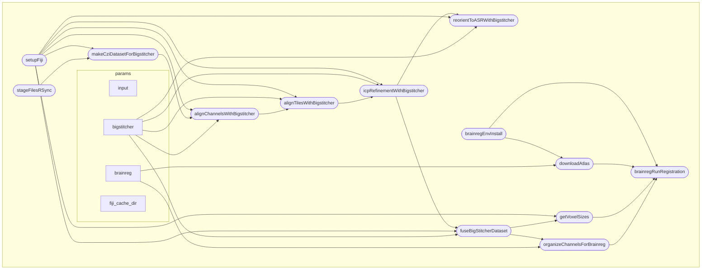

DAG:

Note: to use nextflow on SCITAS cluster, you need the Java module:
// module --show-hidden av 

module load openjdk/21.0.0_35-h27dssk 

module --show-hidden av 

https://www.nextflow.io/docs/latest/install.html#self-install

Example command line:

nextflow run main.nf -resume -profile local --input test_da
ta/ExampleMultiChannel.czi -with-trace